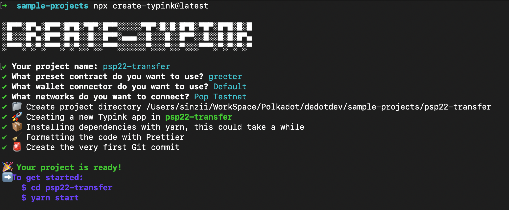
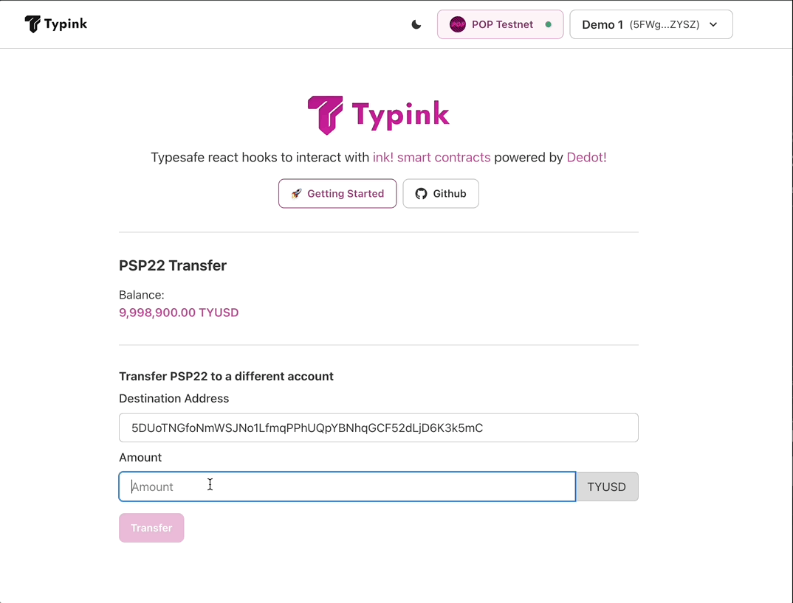

# Develop ink! dApp using Typink

In this tutorial, we'll guide you through the process of developing a simple ink! dApp using Typink- a new set of react hooks & utilities to help to build new ink! dApp faster & easier.

Let's make a simple PSP22 Transfer dApp using Typink!

### Create a new project via `create-typink` CLI

We're going to set up a new ink! dapp project via the `create-typink`cli.

```sh
npx create-typink@latest
```

Let's choose `greeter`  as example contract and deploy our contract to `Pop Testnet`.

<figure><figcaption></figcaption></figure>

We can now go to the `psp22-transfer`folder and run `yarn start`to start the development server at: `http://localhost:8080`

<figure><figcaption></figcaption></figure>

### Claim testnet token via faucet

Next step, in order to deploy & interact with contracts on Pop Testnet, we'll need to claim some test token. Since Pop Testnet as a parachain uses the native token of the Relay Chain (Paseo) as its token to pay transaction fee, so it requires 2 steps to claim testnet token on Pop Testnet.

1. Claim PAS test token on Paseo faucet via [https://faucet.polkadot.io/](https://faucet.polkadot.io/)
2. Transfer PAS token from Paseo to Pop Testnet via [https://onboard.popnetwork.xyz/](https://onboard.popnetwork.xyz/)

After you finished claiming & transfering the PAS token to Pop Testnet, let's compile & deploy our PSP22 contract.

### Compile & deploy PSP22 Contract

We're using this [PSP22 implementation](https://github.com/Cardinal-Cryptography/PSP22) from [Cardinal-Cryptography](https://github.com/Cardinal-Cryptography) (the team behinds Aleph Zero) in this tutorials.

After cloning the repo, we can build the contract using the following commands:

```sh
git clone https://github.com/Cardinal-Cryptography/PSP22

cd PSP22

cargo contract build --release
```

After building the contract, we'll get all the compiled artifacts in folder: `target/ink`

<figure><figcaption></figcaption></figure>

Now let's copy all these 3 files into the folder: `contracts/artifacts/psp22`in our `psp2-transfer`project.

<figure><figcaption></figcaption></figure>

Next, let's deploy our PSP22 contract to Pop Testnet via [https://ui.use.ink/](https://ui.use.ink/)

<figure><figcaption></figcaption></figure>

We'll fill in some basic information of the PSP22 token as below, feel free to adjust the params as to your preferences.

<figure><figcaption></figcaption></figure>

We deployed the contract, and the its address is: `13JSR8RUSxtg11MLg2Pj5jV7Yh9sh9gCnjFW7ReHGmDj5Rvq`

<figure><figcaption></figcaption></figure>

Finally, let's update the contract deployments list in file: `contracts/deployment.ts` to register our new PSP22 contract to the list, this helps us quickly initiaciate new `Contract` instance via Typink's react hooks: `useContract`


```typescript
import { ContractDeployment, popTestnet } from 'typink';
import psp22Metadata from './artifacts/psp22/psp22.json';

export enum ContractId {
  PSP22 = 'psp22'
}

export const deployments: ContractDeployment[] = [
  {
    id: ContractId.PSP22,
    metadata: psp22Metadata as any,
    network: popTestnet.id,
    address: '13JSR8RUSxtg11MLg2Pj5jV7Yh9sh9gCnjFW7ReHGmDj5Rvq',
  },
];


```


### Generate Typescript bindings for the contract

Next, let's generate Typscript bindings/types for our PSP22 contract using its metadata. This helps us enable auto-complete & suggestions (IntelliSense) later when we deal & interact with contract messages / events.

We can do this via `dedot`cli, `dedot` is a required dependency and will be install for for every Typink-based projects. Let's put the generated types in folder: `contracts/types` :

```sh
npx dedot typink -m ./contracts/artifacts/psp22/psp22.json -o ./contracts/types
```

After this step, we're ready to start coding the logic for our application.

<figure><figcaption></figcaption></figure>

### Fetch & show PSP22 balance

First, let's initiate a global `Contract`instance in `AppProvider` (`ui/src/providers/AppProvider.tsx`) so we can use it across our app & components.


```tsx
import { createContext, useContext } from 'react';
import { Props } from '@/types.ts';
import { ContractId } from 'contracts/deployments.ts';
import { Psp22ContractApi } from 'contracts/types/psp22';
import { Contract } from 'dedot/contracts';
import { useContract } from 'typink';

interface AppContextProps {
  psp22Contract?: Contract<Psp22ContractApi>;
}

const AppContext = createContext<AppContextProps>({} as any);

export const useApp = () => {
  return useContext(AppContext);
};

export function AppProvider({ children }: Props) {
  const { contract: psp22Contract } = useContract<Psp22ContractApi>(ContractId.PSP22);

  return (
    <AppContext.Provider
      value={{
        psp22Contract,
      }}>
      {children}
    </AppContext.Provider>
  );
}
```


Next, let's fetch & show the PSP22 balance for connected account. We're going to update the `MainBoard`component (`ui/src/components/MainBoard.tsx`) to add the logic using `useContractQuery`hook to fetch basic contract information (symbol, decimals) and psp22 balance of the connected account.


```tsx
import { Box, Flex, Heading, Text } from '@chakra-ui/react';
import PendingText from '@/components/shared/PendingText.tsx';
import { useApp } from '@/providers/AppProvider.tsx';
import { formatBalance, useContractQuery, useTypink } from 'typink';

interface PSP22TransferProps {
  connectedAddress: string;
}

function PSP22Transfer({ connectedAddress }: PSP22TransferProps) {
  const { psp22Contract: contract } = useApp();
  const tokenSymbol = useContractQuery({ contract, fn: 'psp22MetadataTokenSymbol' });
  const decimals = useContractQuery({ contract, fn: 'psp22MetadataTokenDecimals' });
  const balance = useContractQuery({
    contract,
    fn: 'psp22BalanceOf',
    args: [connectedAddress],
    watch: true,
  });

  const isLoading = tokenSymbol.isLoading && decimals.isLoading && balance.isLoading;

  return (
    <>
      <Text>Balance:</Text>
      <PendingText fontWeight='600' isLoading={isLoading} color='primary.500'>
        {formatBalance(balance.data, { symbol: tokenSymbol.data, decimals: decimals.data })}
      </PendingText>
    </>
  );
}

export default function MainBoard() {
  const { connectedAccount } = useTypink();

  return (
    <Box>
      <Heading size='md' mb={2}>
        PSP22 Transfer
      </Heading>
      <Flex my={4} gap={2}>
        {connectedAccount ? (
          <PSP22Transfer connectedAddress={connectedAccount.address} />
        ) : (
          <Text>Connect to your wallet to getting started!</Text>
        )}
      </Flex>
    </Box>
  );
}
```


Now, after connected to the account we're using to deploy the contract, it's showing the total PSP22 balance of account.

<figure><figcaption></figcaption></figure>

### Create a transfer form/UI

Next, let's create a transfer form which includes the following components:

* Destination Address: the address that we'll transfer the token to
* Amount: the amount of PSP22 token we'll send to the Destination Account
* Submit Button: a button to submit the form


```tsx
import {
  Box,
  Button,
  Divider,
  FormControl,
  FormLabel,
  Heading,
  Input,
  InputGroup
  InputRightAddon,
  Text,
} from '@chakra-ui/react';

// function PSP22Transfer({ connectedAddress }: PSP22TransferProps) {
// ...

<form>
  <Heading size='sm' mb={2}>
    Transfer PSP22 to a different account
  </Heading>
  <FormControl mb={2}>
    <FormLabel>Destination Address</FormLabel>
    <Input placeholder='Address' type='text' />
  </FormControl>

  <FormControl mb={2}>
    <FormLabel>Amount</FormLabel>
    <InputGroup>
      <Input placeholder='Amount' type='number' />
      {tokenSymbol.data && <InputRightAddon>{tokenSymbol.data}</InputRightAddon>}
    </InputGroup>
  </FormControl>

  <Button colorScheme='primary'>Transfer</Button>
</form>

// ...
```


The UI will look like this after we added the form.

<figure><figcaption></figcaption></figure>

### Submit transfer transaction with transaction toaster

Now, let's implement the logic make the transfer transaction using `useContractTx`hook:


```tsx
import {
  Box,
  Button,
  Divider,
  FormControl,
  FormLabel,
  Heading,
  Input,
  InputGroup,
  InputRightAddon,
  Text,
} from '@chakra-ui/react';
import { useState } from 'react';
import PendingText from '@/components/shared/PendingText.tsx';
import { useApp } from '@/providers/AppProvider.tsx';
import { txToaster } from '@/utils/txToaster.tsx';
import { decodeAddress } from 'dedot/utils';
import { formatBalance, useContractQuery, useContractTx, useTypink } from 'typink';

interface PSP22TransferProps {
  connectedAddress: string;
}

function PSP22Transfer({ connectedAddress }: PSP22TransferProps) {
  const { psp22Contract: contract } = useApp();
  const tokenSymbol = useContractQuery({ contract, fn: 'psp22MetadataTokenSymbol' });
  const decimals = useContractQuery({ contract, fn: 'psp22MetadataTokenDecimals' });
  const balance = useContractQuery({
    contract,
    fn: 'psp22BalanceOf',
    args: [connectedAddress],
    watch: true,
  });

  const isLoading = tokenSymbol.isLoading && decimals.isLoading && balance.isLoading;

  const [destAddress, setDestAddress] = useState<string>('');
  const [amount, setAmount] = useState<string>('');
  const transferTx = useContractTx(contract, 'psp22Transfer');

  const enableTransfer = !!destAddress && !!amount && !!decimals.data;

  const doTransfer = async (e: any) => {
    e && e.preventDefault();

    if (!enableTransfer) return;

    const toaster = txToaster();

    try {
      if (destAddress == connectedAddress) {
        throw new Error('Cannot transfer to the same address');
      }

      decodeAddress(destAddress); // validate address
      const amountToTransfer = BigInt(+amount) * BigInt(Math.pow(10, decimals.data!));

      await transferTx.signAndSend({
        args: [destAddress, amountToTransfer, '0x'],
        callback: (progress) => {
          toaster.onTxProgress(progress);
        },
      });
    } catch (e: any) {
      console.error(e);
      toaster.onTxError(e);
    }
  };

  return (
    <>
      <Text>Balance:</Text>
      <PendingText fontWeight='600' isLoading={isLoading} color='primary.500'>
        {formatBalance(balance.data, { symbol: tokenSymbol.data, decimals: decimals.data })}
      </PendingText>
      <Divider my={8} />
      <form onSubmit={doTransfer}>
        <Heading size='sm' mb={2}>
          Transfer PSP22 to a different account
        </Heading>
        <FormControl mb={2}>
          <FormLabel>Destination Address</FormLabel>
          <Input placeholder='Address' type='text' onChange={(e) => setDestAddress(e.target.value)} />
        </FormControl>

        <FormControl mb={4}>
          <FormLabel>Amount</FormLabel>
          <InputGroup>
            <Input placeholder='Amount' type='number' onChange={(e) => setAmount(e.target.value)} />
            {tokenSymbol.data && <InputRightAddon>{tokenSymbol.data}</InputRightAddon>}
          </InputGroup>
        </FormControl>

        <Button
          colorScheme='primary'
          type='submit'
          isDisabled={!enableTransfer}
          isLoading={transferTx.inBestBlockProgress}>
          Transfer
        </Button>
      </form>
    </>
  );
}

export default function MainBoard() {
  const { connectedAccount } = useTypink();

  return (
    <Box>
      <Heading size='md' mb={2}>
        PSP22 Transfer
      </Heading>
      <Box my={4} gap={2}>
        {connectedAccount ? (
          <PSP22Transfer connectedAddress={connectedAccount.address} />
        ) : (
          <Text>Connect to your wallet to getting started!</Text>
        )}
      </Box>
    </Box>
  );
}

```


Now, let's try it out when we transfer some PSP22 token to a different address:

<figure><figcaption></figcaption></figure>

You can always checkout the [Github repo](https://github.com/sinzii/psp22-transfer) of this `psp22-transfer`project, clone & have fun!
