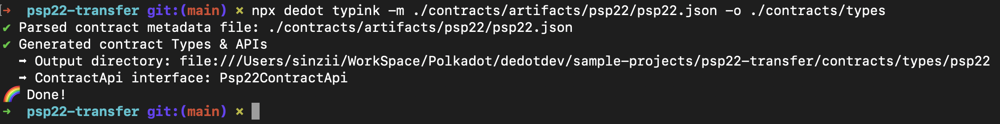

# Develop ink! dApp using Typink!

> WIP 🚧

### Create a new project via `create-typink` CLI

Let's setting up a new ink! dapp project via the `create-typink`cli.

```sh
npx create-typink@latest
```

We're going to use choose `greeter`  as preset contract and deploy our contract to `Pop Testnet` .

<figure><figcaption></figcaption></figure>

We can now go to the `psp22-transfer`folder and run `yarn start`to start the development server at: `http://localhost:8080`

<figure><figcaption></figcaption></figure>

### Claim testnet token via faucet

Next step, in order to deploy & interact with contracts on Pop Testnet, we'll need to claim some test token. Since Pop Testnet as a parachain uses the native token of the Relay Chain (Paseo) as its token to pay transaction fee, so it requires 2 steps to claim testnet token on Pop Testnet.

1. Claim PAS test token on Paseo faucet via [https://faucet.polkadot.io/](https://faucet.polkadot.io/)
2. Transfer PAS token from Paseo to Pop Testnet via [https://onboard.popnetwork.xyz/](https://onboard.popnetwork.xyz/)

After you finished claiming & transfering the PAS token to Pop Testnet, let's compile & deploy our PSP22 contract.

### Compile & deploy PSP22 Contract

We're using this [PSP22 implementation](https://github.com/Cardinal-Cryptography/PSP22) from [Cardinal-Cryptography](https://github.com/Cardinal-Cryptography) (the team behinds Aleph Zero) in this tutorials.

After cloning the repo, we can build the contract using the following commands:

```sh
git clone https://github.com/Cardinal-Cryptography/PSP22

cd PSP22

cargo contract build --release
```

After building the contract, we'll get all the compiled artifacts in folder: `target/ink`

<figure><figcaption></figcaption></figure>

Now let's copy all these 3 files into the folder: `contracts/artifacts/psp22`in our `psp2-transfer`project.

<figure><figcaption></figcaption></figure>

Next, let's deploy our PSP22 contract to Pop Testnet via [https://ui.use.ink/](https://ui.use.ink/)

<figure><figcaption></figcaption></figure>

We'll fill in some basic information of the PSP22 token as below, feel free to adjust the params as to your preferences.

<figure><figcaption></figcaption></figure>

We deployed the contract, and the its address is: `13JSR8RUSxtg11MLg2Pj5jV7Yh9sh9gCnjFW7ReHGmDj5Rvq`

<figure><figcaption></figcaption></figure>

Finally, let's update the contract deployments list in file: `contracts/deployment.ts` to register our new PSP22 contract to the list, this helps us quickly initiaciate new `Contract`via Typink's react hooks: `useContract`


```typescript
import { ContractDeployment, popTestnet } from 'typink';
import psp22Metadata from './artifacts/psp22/psp22.json';

export enum ContractId {
  PSP22 = 'psp22'
}

export const deployments: ContractDeployment[] = [
  {
    id: ContractId.PSP22,
    metadata: psp22Metadata as any,
    network: popTestnet.id,
    address: '13JSR8RUSxtg11MLg2Pj5jV7Yh9sh9gCnjFW7ReHGmDj5Rvq',
  },
];


```


### Generate Typescript bindings for the contract

###

### Fetch & show PSP22 balance

### Create a transfer form/UI

### Submit transfer transaction with transaction toaster

### Conclusion
